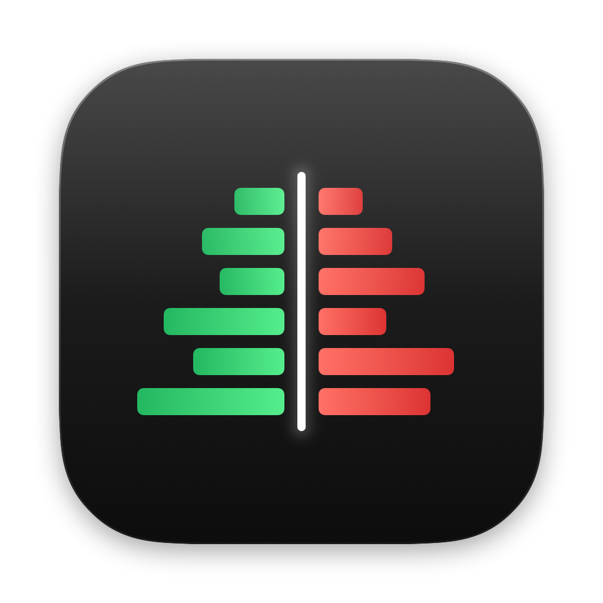

# Depth

[](https://github.com/ChloePike/depth/actions/workflows/build.yml)
[](#license)

A local, multi-exchange crypto trading terminal for macOS. Ten venues streamed side by side,
aggregated into one book, one tape and one chart, with order entry on the venues you hold keys for.
Everything runs on your machine: no relay, no server, no account.



## What it does

**Market data, ten venues at once**: Binance, Bybit, Bitget, OKX, MEXC, Coinbase, Kraken, Gate,
Hyperliquid, Lighter. Spot, margin, perpetuals and options (where the venue lists them).

- Composite index price (venue mids weighted by recent volume), aggregated candles, CVD
- Aggregated order book (mid-aligned per venue, 50 levels each), book heatmap, liquidity walls
- Trades tape, liquidations, open interest, funding (hourly-normalized, with countdown), basis,
  long/short ratios, option chains with greeks
- Per-venue share of volume and resting depth

**Chart**: candles from 1m to 1W, MA, session VWAP with ±1σ/±2σ bands, visible-range volume profile
(POC, value area, high-volume nodes), breakouts through those levels, mark price, estimated
liquidation map, expected-move cone, drawing tools, your positions / orders / TP-SL / liquidation
prices as lines.

**Signals and models** (all thresholds relative to the instrument's own history):
volume spikes, liquidation cascades, OI vs price divergence, crowded funding, spot vs perp flow,
basis extremes, whale prints, cross-venue dislocations; EWMA volatility forecast, book/flow
pressure, carry table.

**Trading** (Bybit and Binance verified on live accounts; OKX, Bitget, Gate, Kraken, Hyperliquid
and Lighter implemented and marked untested): limit / market / post-only / BBO orders, smart order
routing across venues, whole-position and staged TP/SL, close / reverse / close-all, positions with
funding estimates, order / trade / position history, wallets and transfers between a venue's accounts.
Private data arrives over WebSocket pushes, never REST polling.

## Security

- API keys live in the macOS Keychain (service `terminal-one`), never in files or process arguments.
- Use read-only keys first; never enable withdrawal permission.
- Every order goes through a confirmation sheet (configurable); destructive actions ask twice.

## Download

Prebuilt macOS (Apple silicon) builds are attached to each [release](https://github.com/ChloePike/depth/releases).
They are ad-hoc signed, not notarized: on first launch, right-click Depth.app and choose Open.

## Build

Requirements: macOS 26, Rust (stable, edition 2024), Swift 6 (Command Line Tools or Xcode).

```sh
scripts/bundle.sh                 # builds and installs /Applications/Depth.app
APP=dist/Depth.app scripts/bundle.sh   # build into another location
```

Development:

```sh
cargo test --workspace                                   # unit tests
cargo run --bin probe -- binance perp BTC USDT 20        # live check of one connector
scripts/probe-all.sh 20                                  # every exchange x market
cargo run --release -p t1-ui                             # the all-egui build (any platform)
```

## Layout

```
src/        data layer: exchange connectors (src/ex), aggregation (agg.rs), trading (trade/),
            routing (route.rs), signals and models (quant.rs), WebSocket / REST plumbing (ws.rs)
ui/         egui UI: chart, book, options; the native app hosts it for the chart and book
ffi/        C ABI used by the SwiftUI app (state snapshot as JSON, actions, rendering into a view)
app/        SwiftUI macOS app: toolbar, order panel, account tables, settings
scripts/    bundling, icon, live regression
```

## Disclaimer

This is a personal tool, not financial advice. Signals and models are descriptive and unvalidated.
Trading on leverage can lose more than the margin you put up. Test every venue with the minimum size.

## License

Licensed under either of [Apache License 2.0](LICENSE-APACHE) or [MIT](LICENSE-MIT) at your option.
Exchange logos in `assets/icons` are trademarks of their owners and are used only to identify the venues.
